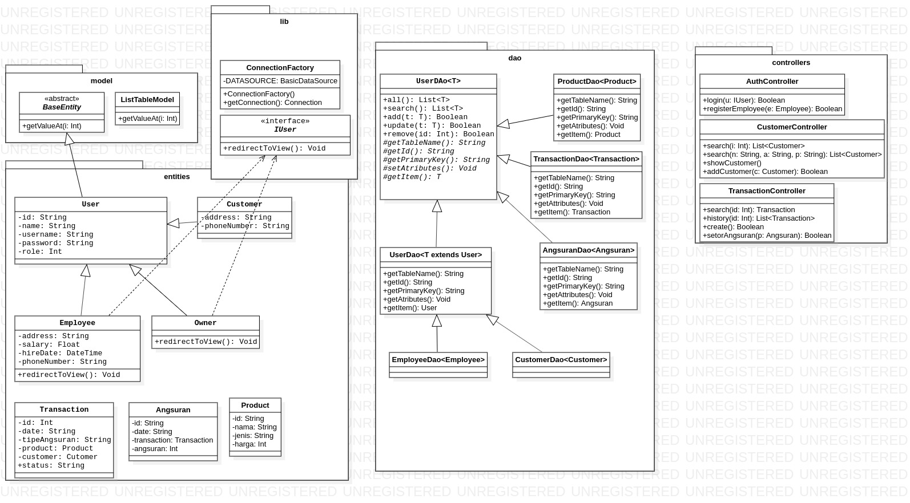
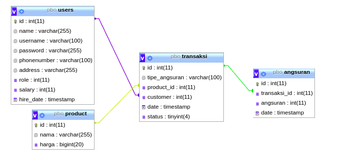

# Software Kredit

### Class Diagrams


### Entity Relational Diagrams



## Setup

Create file `.config.properties` in your home directory :
```bash
$ touch ~/.config.properties
$ nano ~/.config.properties

server=localhost
database=pbo
username=root
password=nganu

```

## Run

Run with Maven.
